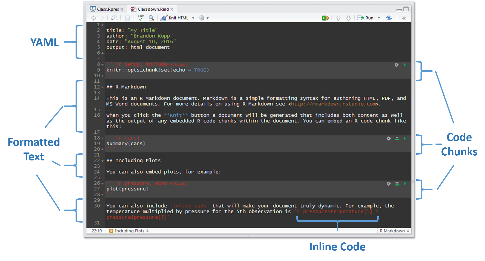
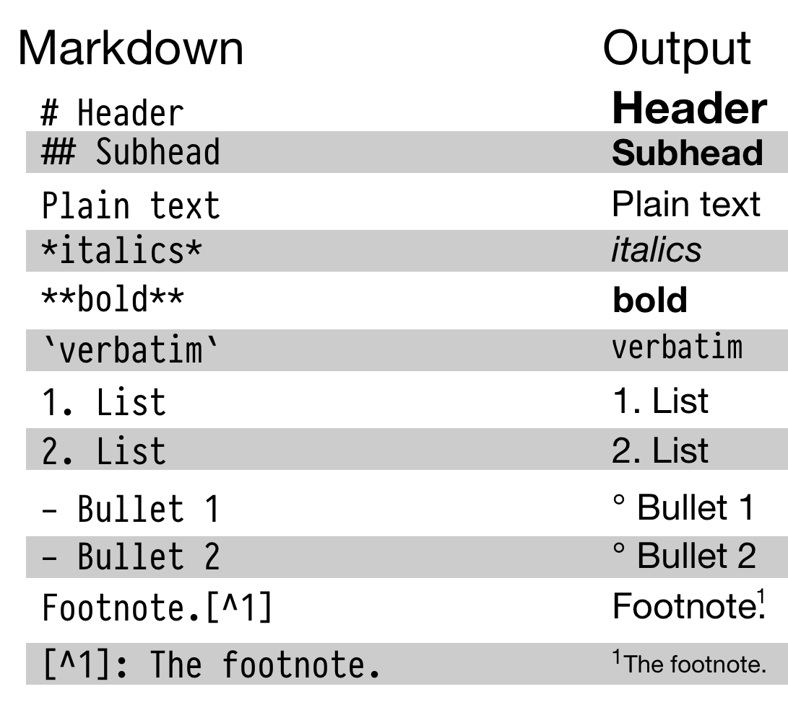

```{r setup, include=FALSE}
options(htmltools.dir.version = FALSE)
# see: https://github.com/yihui/xaringan
# install.packages("xaringan")
# see: 
# https://github.com/yihui/xaringan/wiki
# https://github.com/gnab/remark/wiki/Markdown
options(width=110)
options(digits = 4)
```


class: inline-grey
# Outline

1. Introduction
2. Statistical Modeling in `R`
3. Dealing with repeated-measures (pooling)
4. Mixed models

---
class: small

### Research and Statistics

- *Substantive research questions*
    1. Negative cognitive distortions sustain depressive symptoms.
    2. Interference and not decay is the main source of forgetting in memory.
    3. Inhibition is a specific and general mental ability, like IQ. 

--

- *Operationalization and measurement*
    1. Educating patients how to escape their negative thoughts should reduce depressive symptoms.
    2. Control independently time of delay and amount of new information.
    3. Ability to suppress distracting information should be related across tasks. For example, Stroop performance and flanker performance.
    
--


- Substantive questions cannot be directly adressed via empirical means (e.g., [Duhem-Quine thesis](https://en.wikipedia.org/wiki/Duhem%E2%80%93Quine_thesis))
- Researchers use empirical observations (data) for making arguments about research questions.
- Appropriate *research methods* (e.g., experimental design, reliability, validity, reproducibility) help in making better (i.e., more convincing) arguments. 
- *Data visualization* and *Statistics* are important aspect that can help in making such arguments:
    - Statistics alone cannot prove nor disprove a substantive research question or an empirical hypothesis: *Statistical arguments need context (e.g., data visualization).*
    - Some statistical arguments are better, some are worse, and some have essentially no evidential value.
    - Statistics is like a toolkit, researchers have to select right tool for each job.
--
- "There are no routine statistical questions, only questionable statistical routines." (David Cox)
- "The combination of some data and an aching desire for an answer does not ensure that a reasonable answer can be extracted from a given body of data." (John Tukey)
    

---

## Tools: `RMarkdown` and `tidyverse`

- Context requires combination of a narrative/prose with data visualization and statistical results.
- `RMarkdown` "authoring framework for data science".
- Single document, `.Rmd` file, combines text, pictures, and `R` code.
- Render document: Runs code and combines text, pictures, code, and output (i.e., text output and plots) into nicely formatted result:
    - `html` file
    - `pdf` or `Word` file
    - presentation (like this one)
    - blog or other website (`blogdown`), books (`bookdown`), interactive tutorials (`learnr`), github document, [...](https://www.rstudio.com/resources/videos/r-markdown-eight-ways/)
- `RMarkdown` is efficient, easy to use, ensures reproducibility, and is ideal for communicating results with collaborators or even for writing papers (i.e., [`papaja`](https://github.com/crsh/papaja)).

--

- `tidyverse`

---

### `RMarkdown` Document Example ([source](http://rstudio-pubs-static.s3.amazonaws.com/202429_acbbe794b27f4dffaac6047d1b6d5aa0.html))



---
class:inline-grey, small

### `RMarkdown` - First Steps

- Create new `RMarkdown` document: `File` -> `New File` -> `R Markdown...`
- Enter title and your name -> Keep `html` selected -> `Ok`
- `Save` file somewhere (e.g., `test.Rmd` in `Downloads`) -> `Knit` creates and opens `html` document

--

```{eval = FALSE}
---
title: "My Title"
author: "Henrik Singmann"
date: "`r format(Sys.time(), '%d %B, %Y')`"
output: 
  html_document:
    toc: TRUE
    toc_float: true
    theme: paper
    highlight: espresso
---
```

- `YAML` Stands for "YAML Ain't Markup Language"
- This is where you set options for your overall document, for example: 
      - [output format](https://rmarkdown.rstudio.com/formats.html) (`html_document`, `pdf_document`, `word_document`, `github_document`, ...)
      - add and format table of content
      - appearance (also add custom `css`)
      - see: https://rmarkdown.rstudio.com/html_document_format.html

---
class: small

### Text Formatting 

.pull-left[


`[link](www.rstudio.com)` -> [link](www.rstudio.com)


(source: http://socviz.co/gettingstarted.html#work-in-plain-text-using-rmarkdown)
]


---

## Code Formatting

---

###  Links
- `RStudio` cheat sheets: https://www.rstudio.com/resources/cheatsheets/
    - `RStudio`: https://github.com/rstudio/cheatsheets/raw/master/rstudio-ide.pdf
    - `RMarkdown`: https://github.com/rstudio/cheatsheets/raw/master/rmarkdown-2.0.pdf
    - `ggplot2`: https://github.com/rstudio/cheatsheets/raw/master/data-visualization-2.1.pdf
    - `dplyr` & `tidyr`: https://github.com/rstudio/cheatsheets/raw/master/data-transformation.pdf

- Introduction to Open Data Science: http://ohi-science.org/data-science-training/
- R for Data Science: http://r4ds.had.co.nz/
- Data Visualization: A practical introduction: http://socviz.co/
- Exploratory Data Analysis with R: https://bookdown.org/rdpeng/exdata/
- The Art of Data Science: https://bookdown.org/rdpeng/artofdatascience/

---
class: small

### Skovgaard-Olsen et al. (2016)

- Does the Equation (i.e., *P*(if *A* then *B*) = *P*(*B*|*A*)) hold even if no apparent relationship between *A* and *B*? 
  - positive relevance (PO): *A* is a reason for *B* 
  - negative relevance (NE): *A* is a reason against *B* 
  - irrelevance (IR): *A* and *B* have no apparent relationship 

- For each item, participants provide idiosyncratic estimates of *P*(if *A* then *B*) and *P*(*B*|*A*).
- Each participant worked on 12 items, 4 per relevance condition (i.e., a 4 x 3 within-subjects design)

- Data in the `exercises`folder (also available at: https://osf.io/j4swp/)

--

### Exercise 1: Analyse the data using the no-pooling approach.
- Calculate the regression between *P*(if *A* then *B*) and *P*(*B*|*A*) separately for each participant and within-subjects condition.
- Does this analysis yield some interpretable differences in the regression coefficients between the conditions?
- For precise instructions see: `exercises/exercise_1.Rmd`

---
### References Statistical Modeling:
- John Fox and Sanford Weisberg (2011). *An R Companion to Applied Regression, Second Edition.* Thousand Oaks CA: Sage. URL: http://socserv.socsci.mcmaster.ca/jfox/Books/Companion
- Russell V. Lenth (2016). Least-Squares Means: The R Package lsmeans. *Journal of Statistical
  Software*, 69(1), 1-33. https://doi.org/10.18637/jss.v069.i01
- Cohen, J., Cohen, P., West, S. G., & Aiken, L. S. (2002). *Applied Multiple Regression/Correlation Analysis for the Behavioral Sciences.* New York: Routledge Academic.

### References Example Data:
- Revelle, William, Wilt, Joshua, and Rosenthal, Allen (2009) Personality and Cognition: The Personality-Cognition Link. In Gruszka, Alexandra and Matthews, Gerald and Szymura, Blazej (Eds.) _Handbook of Individual Differences in Cognition: Attention, Memory and Executive Control_, Springer.
- Skovgaard-Olsen, N., Singmann, H., & Klauer, K. C. (2016). The relevance effect and conditionals. *Cognition*, 150, 26-36. https://doi.org/10.1016/j.cognition.2015.12.017
