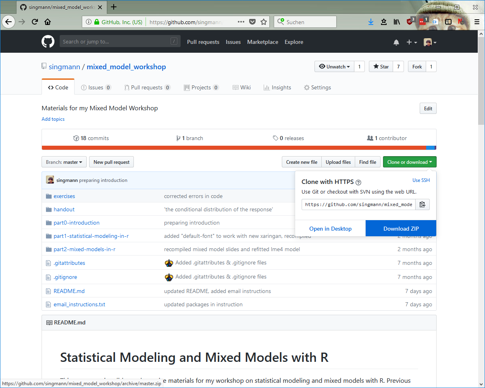
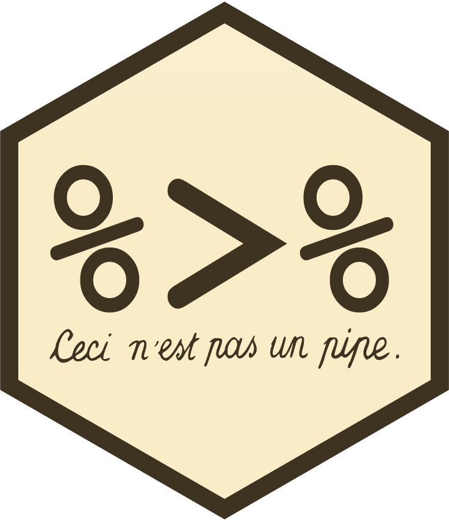

```{r setup, include=FALSE}
options(htmltools.dir.version = FALSE)
# see: https://github.com/yihui/xaringan
# install.packages("xaringan")
# see: 
# https://github.com/yihui/xaringan/wiki
# https://github.com/gnab/remark/wiki/Markdown
options(width=110)
options(digits = 4)
```


class: inline-grey
# Outline

1. Introduction: Modern `R`
2. Statistical Modeling in `R`
3. Dealing with repeated-measures (pooling)
4. Mixed models

---
class: small

### Research and Statistics

- *Substantive research questions*
    1. Negative cognitive distortions sustain depressive symptoms.
    2. Interference and not decay is the main source of forgetting in memory.
    3. Inhibition is a specific and general mental ability, like IQ. 

--

- *Operationalization and measurement*
    1. Educating patients how to escape their negative thoughts should reduce depressive symptoms.
    2. Control independently time of delay and amount of new information.
    3. Ability to suppress distracting information should be related across tasks. For example, Stroop performance and flanker performance.
    
--


- Substantive questions cannot be directly adressed via empirical means (e.g., [Duhem-Quine thesis](https://en.wikipedia.org/wiki/Duhem%E2%80%93Quine_thesis)).
- Researchers use empirical observations (data) for making arguments about research questions.
- Appropriate *research methods* (e.g., experimental design, reliability, validity, reproducibility) help in making better (i.e., more convincing) arguments. 
- *Data visualization* and *statistics* are important tools for making good arguments about data:
    - A statistic cannot prove nor disprove a substantive research question or empirical hypothesis: *statistical arguments need context (e.g., data visualization).* [this is why AIC/BIC/WAIC/... often sucks]
    - Some statistical arguments are better, some are worse, and some have essentially no evidential value.
    - *Statistics is not a ritual* (e.g., [Gigerenzer, 2018](https://doi.org/10.1177/2515245918771329)). Instead, statistics is a toolkit, researchers have to select the right tool for each job.
--
- "There are no routine statistical questions, only questionable statistical routines." (David Cox)
- "The combination of some data and an aching desire for an answer does not ensure that a reasonable answer can be extracted from a given body of data." (John Tukey)
    

---

### Process and Tools: `tidyverse` and `RMarkdown`

 

Conceptual model of data analysis (source: [Wickham & Grolemund (2017): R for Data Science](http://r4ds.had.co.nz))


--

- `tidyverse`: Selection of packages curated/developed by `RStudio`:
    - [`readr`](https://readr.tidyverse.org/): Reading data in, the `RStudio` way.
    - Data wrangling with [`tibble`](http://tibble.tidyverse.org/), [`magrittr`](http://magrittr.tidyverse.org/), [`tidyr`](http://tidyr.tidyverse.org/), and [`dplyr`](http://dplyr.tidyverse.org/): Coherent set of functions for tidying, transforming, and working with rectangular data. Supersedes many base `R` functions and makes common problems easy. 
    - [`ggplot2`](http://ggplot2.tidyverse.org/): System for data visualization.
    - [`purrr`](http://purrr.tidyverse.org/) and [`broom`](https://broom.tidyverse.org/): Advanced modeling with the `tidyverse`.

--

- `RMarkdown` "authoring framework for data science".

---

# `RMarkdown`


- Context requires combination of a narrative/prose with data visualization and statistical results.
- `RMarkdown` "authoring framework for data science".
- Single document, `.Rmd` file, combines text, pictures, and `R` code.
- Render document: Runs code and combines text, pictures, code, and output (i.e., text output and plots) into nicely formatted result:
    - `html` file
    - `pdf` or `Word` file
    - presentation (like this one)
    - blog or other website (`blogdown`), books (`bookdown`), interactive tutorials (`learnr`), [...](https://www.rstudio.com/resources/videos/r-markdown-eight-ways/)

--

- `RMarkdown` is efficient, easy to use, ensures reproducibility, and
  - is ideal for communicating results with collaborators or PIs,
  - can be used for for writing preregistrations with [`prereg`](https://cran.r-project.org/package=prereg), 
  - and even for writing papers (i.e., [`papaja`](https://github.com/crsh/papaja)).

--


- *Warning:* If you send an `RMarkdown` `html` report, it needs to be downloaded before figures are visible (e.g., opening it directly from `gmail` does not show plots)!

---
class:inline-grey, small

### `RMarkdown` - First Steps

- Create new `RMarkdown` document: `File` -> `New File` -> `R Markdown...`
- Enter title and your name -> Keep `html` selected -> `Ok`
- `Save` file somewhere (e.g., `test.Rmd` in `Downloads`) -> `Knit` creates and opens `html` document


---

### `RMarkdown` Document Example ([source](http://rstudio-pubs-static.s3.amazonaws.com/202429_acbbe794b27f4dffaac6047d1b6d5aa0.html))


---
class:inline-grey, small

### `RMarkdown` - YAML Header


```{r, eval = FALSE}
---
title: "My Title"
author: "Henrik Singmann"
date: "`r format(Sys.time(), '%d %B, %Y')`"
output: 
  html_document:
    toc: TRUE
    toc_float: true
    theme: paper
    highlight: espresso
---
```

- `YAML` Stands for "YAML Ain't Markup Language"
- This is where you set options for your overall document, for example: 
      - [output format](https://rmarkdown.rstudio.com/formats.html) (`html_document`, `pdf_document`, `word_document`, `github_document`, ...)
      - add and format table of content
      - appearance (also add custom `css`)
      - see [`RMarkdown` cheat sheet](https://github.com/rstudio/cheatsheets/raw/master/rmarkdown-2.0.pdf) or https://rmarkdown.rstudio.com/html_document_format.html

---
class: small

### Text Formatting 

.pull-left[


`[link](www.rstudio.com)` -> [link](www.rstudio.com)


(source: http://socviz.co/gettingstarted.html#work-in-plain-text-using-rmarkdown)
]


---
class: small


---

### Code Chunks

````
```{r chunk_name, echo=FALSE}`r ''`
1 + 1
```
````

```{r, echo=FALSE}
1 + 1
```

- Run a code chunk with `Ctrl`/`Cmd` + `Shift` + `Enter`

Important chunk options:
- `echo`: Display code in output document (default = `TRUE`)
- `eval`: Run code in chunk (default = `TRUE`)
- `include`: Include chunk and output in doc after running (default = `TRUE`)
- `fig.height` and `fig.width`: Dimensions of plots in inches
- `error`: Display error messages in doc (`TRUE`) or stop render when errors occur (`FALSE`) (default = `FALSE`)
- `warning`: display code warnings in document (default = `TRUE`)
- `results`: How to format results:
  - default = `'markup'`
  - `'asis'` - pass through results
  - `'hide'` - do not display results
  - `'hold'` - put all results below all code
- `cache`: cache results for future knits (default = `FALSE`)

--

Try replacing `summary(cars)` with `str(cars)`

---
class: small, inline-grey

- visit: [`https://github.com/singmann/mixed_model_workshop/releases`](https://github.com/singmann/mixed_model_workshop/releases)
- Download `Source code (zip)` (or `Source code (tar.gz) `)




---
class: inline-grey

## Workshop Materials

- `zip` Archive contains all materials (e.g., slides, code, exercises) of the current workshop
- Extract `zip` archive if necessary
- All slides are built using `RMarkdown` and `xaringan` package.
- `part0-introduction` materials for introduction session (these slides).
-  `part1-statistical-modeling-in-r` materials for statistical modeling session.
- `part2-mixed-models-in-r` materials for mixed models session.
- In each folder:
  - `.Rmd` file is the `RMarkdown` containing text and code for the slides.
  - `.R` file only contains the code for the slides and no text.
  - You can follow the presentation by following either file. Don't forget:
      - Run a code chunk (i.e., grey block) with `Ctrl`/`Cmd` + `Shift` + `Enter`
      - Run a single line of code with `Ctrl`/`Cmd` + `Enter`
  - `.html` is the full presentation you are seeing. After opening, press `h` for help.
- `exercises` contains some exercises.
- `handout` contains the handout (also includes the `RMarkdown` file)

---
class: center, middle, inverse

# `tidyverse`

---
class: small

.pull-left[
### `tibble`

- "**tibble** or `tbl_df` is a modern reimagining of the data.frame, keeping what time has proven to be effective, and throwing out what is not."
- Dramtically enhanced `print` method.
- Does not change `strings` to `factors`.
- Complains when a variable is missing (i.e., no partial matching).
- Allows list columns (with nice printing).

```{r, eval=FALSE}
iris
```

```{r, eval=TRUE, echo=FALSE}
options(width = 50)
iris[1:5, 1:3] # [...]
```

[...]

```{r, eval=TRUE}
iris$Spec
```
]

--

.pull-right[
```{r, eval=TRUE}
library("tibble") 
iris2 <- as_tibble(iris)
iris2
iris2$Spec
```

]

---
class:inline-grey

## `magrittr`  

- Pipe operator `%>%` makes code more readable:
  - structuring sequences of data operations left-to-right (as opposed to from the inside and out)
  - avoiding nested function calls,
  - minimizing need for local variables and function definitions.
-  Add pipe with `Ctrl`/`Cmd` +`Shift` + `m` 

.pull-left[
### Pipe

```{r, eval=FALSE}
x %>% f
x %>% f(y)
x %>% f %>% g %>% h

x %>% f(y, .)
x %>% f(y, z = .)
```

]

.pull-right[
### Base R
```{r, eval=FALSE}
f(x)
f(x, y)
h(g(f(x)))

f(y, x)
f(y, z = x)
```

]

--

Try it out:
```{r, eval=FALSE}
library(magrittr)
iris2$Sepal.Length %>% 
  mean
```

---
class: small

### Tidy Data (`tidyr`)

*"Tidy datasets are all alike, but every messy dataset is messy in its own way." -- Hadley Wickham*

1. Put each data set in a `tibble`.
2. Put each variable in a column.
    1. Each variable must have its own column.
    2. Each observation must have its own row.
    3. Each value must have its own cell.

--

- For psychologists: Transform wide into long data. See also: 
- Wickham, H. (2014). Tidy data. *The Journal of Statistical Software*, 59(10). http://www.jstatsoft.org/v59/i10
- Wickham, H., & Grolemund, G. (2017). R for Data Science (ch. 12). http://r4ds.had.co.nz/tidy-data.html

---

### `dplyr`

- grammar of data manipulation, providing a consistent set of verbs that help you solve the most common data manipulation challenges:
  - `mutate()` adds new variables that are functions of existing variables
  - `select()` picks variables based on their names.
  - `filter()` picks cases based on their values.
  - `summarise()` reduces multiple values down to a single summary.
  - `arrange()` changes the ordering of the rows.
- All combine naturally with `group_by()` which allows performing any operation "by group".

--

.pull-left[
```{r, message=FALSE}
library("dplyr")
iris2 %>% 
  filter(Species == "setosa") %>% 
  summarise(mean(Sepal.Length))
```

]

--

.pull-right[

```{r}
iris2 %>%
  group_by(Species) %>% 
  summarise(mean_l = mean(Sepal.Length),
            max_l = max(Sepal.Length),
            min_l = min(Sepal.Length),
            sd_l = sd(Sepal.Length))
```
]


---

### `ggplot2`

- System for declaratively creating graphics, based on "The Grammar of Graphics" by Leland Wilkinson
- "You provide data, tell `ggplot2` how to map variables to aesthetics what graphical primitives to use, and it takes care of the details."
- `ggplot()` is the basic function which takes the data.
- `aes()` is used for mapping aesthetics.
- `geom_...` tells which primitive to use. 

```{r, eval=FALSE}
library("ggplot2")
ggplot(iris2, aes(x = Petal.Width, y = Petal.Length)) +
  geom_point()
```
--

```{r, eval=FALSE}
ggplot(iris2, aes(x = Petal.Width, y = Petal.Length, color = Species)) +
  geom_point()
```
--


```{r, eval=FALSE}
ggplot(iris2, aes(x = Species, y = Petal.Length)) +
  geom_jitter(width = 0.2) +
  geom_boxplot(fill = "transparent") +
  theme_bw()
```
--

- Learning `ggplot2`:
  - R for Data Science, http://r4ds.had.co.nz/, ch. 3 and ch. 28
  - `ggplot2` cheat sheet: https://github.com/rstudio/cheatsheets/raw/master/data-visualization-2.1.pdf

---

## Summary

 

- Data analysis and statistics are iterative processes.
- Goal of statistics is to support arguments connecting empirical data and substantive research questions.

### `tidyverse`
- Selection of packages providing a unified approach and syntax to common data analysis problems. 
- To learn more about the `tidyverse` check out the free "R for Data Science" book by Wickham & Grolemund: http://r4ds.had.co.nz/

### `RMarkdown`
- Allows combining prose, code, and output into one nicely formatted document. 
- Great for communicating results and ensuring reproducibility.

---
class: inline-grey

### Exercise

- Open `exercises/exercise_0.Rmd` (or the exercise handout or  `exercises/exercise_0.nb.html` for a nicer format of the instruction).
- Follow text and try to solve a few small tasks helping you to get comfortable with the `tidyverse` (without looking at the solution).
- Main goal is for you getting comfortable with `dplyr` and `ggplot2` syntax.
- Exercise uses response time data from Freeman, Heathcote, Chalmers, and Hockley (2010).
- Participants did a lexical-decision task or a naming task.

The exercise uses yet another type of `RMarkdown` document, `html_notebook` instead of `html_document`:
- `html_document`: "knitting" runs all code in a new `R` process from beginning to end (which ensures reproducibility).
- In contrast, a `html_notebook`
  - uses current `R` process (i.e., state of `Console`), similar to [`Jupyter`](http://jupyter.org/) (does *NOT* ensure reproducibility),
  - allows to `Preview` the current state of the document as a `html` file,
  - potentially better for initial analysis or situations involving expensive calculations,
  - can be transformed into `html_document` by simply changing the YAML header.

Remember:
- Run a code chunk (i.e., grey block) with `Ctrl`/`Cmd` + `Shift` + `Enter`
- Run a single line of code with `Ctrl`/`Cmd` + `Enter`

---

###  Links
- `RStudio` cheat sheets: https://www.rstudio.com/resources/cheatsheets/
    - `RStudio`: https://github.com/rstudio/cheatsheets/raw/master/rstudio-ide.pdf
    - `RMarkdown`: https://github.com/rstudio/cheatsheets/raw/master/rmarkdown-2.0.pdf
    - `ggplot2`: https://github.com/rstudio/cheatsheets/raw/master/data-visualization-2.1.pdf
    - `dplyr` & `tidyr`: https://github.com/rstudio/cheatsheets/raw/master/data-transformation.pdf

- Introduction to Open Data Science: http://ohi-science.org/data-science-training/
- R for Data Science: http://r4ds.had.co.nz/
- Data Visualization: A practical introduction: http://socviz.co/
- Exploratory Data Analysis with R: https://bookdown.org/rdpeng/exdata/
- The Art of Data Science: https://bookdown.org/rdpeng/artofdatascience/


