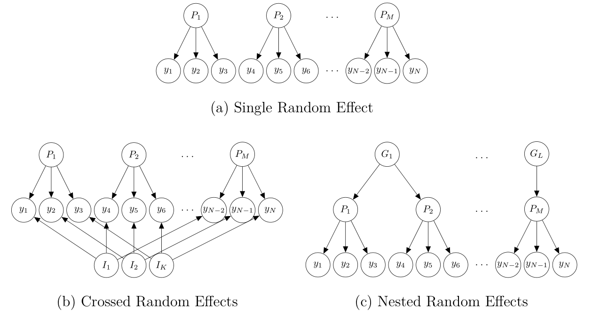

```{r setup, include=FALSE}
options(htmltools.dir.version = FALSE)
# see: https://github.com/yihui/xaringan
# install.packages("xaringan")
# see: 
# https://github.com/yihui/xaringan/wiki
# https://github.com/gnab/remark/wiki/Markdown
options(width=110)
options(digits = 4)
```

# Mixed Model Analysis

Steps for running a mixed model analysis:
1. Identify desired fixed-effects structure
2. Identify random-effects grouping factors
3. Identify which factors/terms vary within levels of each random-effects grouping factor: maximal model
4. Choose method for calculating *p*-values and fit maximal model
5. Iteratively reduce random-effects structure until all degenerate random-effects parameters are removed.

---

# Mixed Models

- Modern class of statistical models that extend regular regression models
- Implement *partial pooling* via random-effects parameters
- Random-effects parameters can account for dependencies among related data points

--

.pull-left[

### Fixed Effects
- Overall  or *population-level average* effect of specific model term (i.e., main effect, interaction, parameter) on dependent variable
- Independent of stochastic variability controlled for by random effects
- Hypothesis tests on fixed effect interpreted as hypothesis tests for terms in standard ANOVA or regression model
- Possible to test specific hypotheses among factor levels (e.g., planned contrasts)

]

.pull-right[
### Random Effects

- *Random-effects grouping factors*: Categorical variables that capture random or stochastic variability (e.g., participants, items, groups, or other hierarchical-structures).
- In experimental settings, random effects grouping factors often part of design one wants to generalize over.
- Random effects factor out idiosyncrasies of sample, thereby providing a more general estimate of the fixed effects of interest.
- *Random-effects parameters*: Provide each level of random-effects grouping factor with idiosyncratic parameter set.

]

---
class: inline-grey, small

### Mixed Models Formulas with `lme4`/`afex` 

- Full mixed model is specified in one formula. For example: `dv ~ fixed + (random|id)`
- Random effects are inside parentheses with a `|`:
  - random-effects parameters left of `|`
  - random-effects grouping factor is right of `|`
- Fixed effects are usually outside parentheses

| Formula | Interpretation  |
| ------------------------|----------------------------------|
| <code>(1&#124;s)</code>               | random intercepts for `s` (i.e., by-`s` random intercepts) | 
| <code>(1&#124;s)+(1&#124;i)</code>   |  by-`s` and by-`i` (i.e., crossed) random intercepts |
| <code>(a&#124;s)</code> or <code>(1+a&#124;s)</code>               | by-`s` random intercepts and by-`s` random slopes for `a` plus their correlation|
| <code>(a*b&#124;s)</code>                 | by-`s` random intercepts and by-`s` random slopes for `a`, `b`, and the `a:b` interaction plus correlations among the by-`s` random effects parameters |
| <code>(0+a&#124;s)</code>  | by-`s` random slopes for `a` and no random intercept |
| <code>(a&#124;&#124;s)</code> | by-`s` random intercepts and by-`s` random slopes for `a`, but no correlation (expands to: <code>(0+a&#124;s) + (1&#124;s)</code>) |

*Note*: Suppressing correlation parameters via `||` works only for numerical variables in `lmer` and not for factors. In `afex::mixed` it works if  `expand_re = TRUE`.


---
class:small

```{r, echo=FALSE, results='hide', message=FALSE}
load("ssk16_dat_tutorial.rda") 
str(dat)
datr <- droplevels(dat[dat$rel_cond != "NE",])
library("ggplot2")
afex::set_sum_contrasts()
library("lme4")
```


# Example Data: Skovgaard-Olsen et al. (2016)

- Is there an overall association between *P*(if *A* then *B*) and *P*(*B*|*A*)?
- For technical reason, we work with scaled variables. `lme4` works better with variables near -1 to 1.

.pull-left[

```{r}
m_fixed <- lm(if_A_then_B_c ~ B_given_A_c, datr)
summary(m_fixed)
```
]
.pull-right[

```{r, echo=FALSE, dpi=500, fig.width=3.5, fig.height=3.5}
par(pty="s")
limits <- c(-0.5, 0.5)
plot(if_A_then_B_c ~ B_given_A_c, datr, asp = 1, ylim=limits, xlim=limits)
abline(m_fixed)
```

$$y=\beta_0 + \beta_{B|A}X_{B|A} + \epsilon$$

]

---
class: small

.pull-left2[
### Fixed Effects Model

$$y=\beta_0 + \beta_{B|A}X_{B|A} + \epsilon$$

- $\beta$ are scalar regression parameters
- $X$ is a covariate vector (numerical independent variable)
- assumes error vector $\epsilon$ is *iid*, $\epsilon \sim \mathcal{N}(0, \sigma^2_{\epsilon})$, which is likely false.
]

.pull-right2[
```{r, echo=FALSE, dpi=300, fig.width=3.5, fig.height=4}
par(pty="s")
plot(if_A_then_B_c ~ B_given_A_c, datr, asp = 1, ylim=limits, xlim=limits)
abline(m_fixed)
```
]

--

### A First Mixed Effects Model

$$y=\beta_0 + (\beta_{B|A}+ S_{B|A})X_{B|A} + \epsilon$$
- $S_{B|A}$ is a zero-centered vector of participant specific random effects: $S_{B|A} \sim \mathcal{N}(0, \sigma^2_{S_{B|A}})$
- $S_{B|A}$ provides each participant with their own regression weight: overall $\beta_{B|A}$ plus idiosyncratic $S_{B|A}$.
- As parameter, model estimates variance of random effects vector, $\sigma^2_{S_{B|A}}$.
- As $S_{B|A}$ alters the regression slope $\beta_{B|A}$, also known as *random slope*.
- In `lme4::lmer` syntax: `lmer(if_A_then_B ~ B_given_A + (0+B_given_A|p_id), datr)`

---
class: small


.pull-left2[
### Fixed Effects Model

$$y=\beta_0 + \beta_{B|A}X_{B|A} + \epsilon$$

- $\beta$ are scalar regression parameters
- $X$ is a covariate vector (numerical independent variable)
- assumes error vector $\epsilon$ is *iid*, $\epsilon \sim \mathcal{N}(0, \sigma^2_{\epsilon})$, which is likely false.
]

.pull-right2[
```{r, echo=FALSE, dpi=500, fig.width=3.5, fig.height=4, warning=FALSE}
m_tmp <- lmer(if_A_then_B_c ~ B_given_A_c + (0+B_given_A_c|p_id), datr)
rnd_coefs <- coef(m_tmp)$p_id
par(pty="s")
plot(if_A_then_B_c ~ B_given_A_c, datr, 
     asp = 1, ylim=limits, xlim=limits)
for (i in seq_len(nrow(rnd_coefs))) 
  abline(a = rnd_coefs[i,1], 
         b = rnd_coefs[i,2],
         col = "lightgrey")
abline(m_fixed)
```
]

### A First Mixed Effects Model

$$y=\beta_0 + (\beta_{B|A}+ S_{B|A})X_{B|A} + \epsilon$$
- $S_{B|A}$ is a zero-centered vector of participant specific random effects: $S_{B|A} \sim \mathcal{N}(0, \sigma^2_{S_{B|A}})$
- $S_{B|A}$ provides each participant with their own regression weight: overall $\beta_{B|A}$ plus idiosyncratic $S_{B|A}$.
- As parameter, model estimates variance of random effects vector, $\sigma^2_{S_{B|A}}$.
- As $S_{B|A}$ alters the regression slope $\beta_{B|A}$, also known as *random slope*.
- In `lme4::lmer` syntax: `lmer(if_A_then_B ~ B_given_A + (0+B_given_A|p_id), datr)`


---
class: small

### A More Reasonable Mixed Model

First model did not allow for different intercepts, $\beta_0$, for each participant. 

$$y=\beta_0 + S_0 + (\beta_{B|A}+ S_{B|A})X_{B|A} + \epsilon$$
- Model now has a random intercept, $S_0$, and a random slope, $S_{B|A}$.
- $S$-vectors still zero-centered vectors of participant specific random effects. However, we now estimate both, variance and covariance of random effects:
  
$$\left( \begin{matrix} S_0 \\ S_{B|A} \end{matrix} \right)
 \sim \mathcal{N}\left( \left[ \begin{matrix} 0 \\ 0 \end{matrix} \right] , \left[ \begin{matrix} \sigma^2_{S_0}&\rho_{S_{0},S_{B|A}}\sigma_{S_{0}}\sigma_{S_{B|A}} \\ \rho_{S_{B|A},S_{0}}\sigma_{S_{0}}\sigma_{S_{B|A}}&\sigma^2_{S_{B|A}} \end{matrix} \right] \right)$$

Each $S_i$ idiosyncratic intercept & slope: `lmer(if_A_then_B ~ B_given_A + (B_given_A|p_id), datr)`

```{r, echo=FALSE, dpi=300, fig.width=3.5, fig.height=3.5, warning=FALSE, out.width='25%'}
m_tmp <- lmer(if_A_then_B_c ~ B_given_A_c + (1+B_given_A_c|p_id), datr)
rnd_coefs <- coef(m_tmp)$p_id
rnd_coefs <- coef(m_tmp)$p_id
par(pty="s")
plot(if_A_then_B_c ~ B_given_A_c, datr,
     asp = 1, ylim=limits, xlim=limits)
for (i in seq_len(nrow(rnd_coefs))) 
  abline(a = rnd_coefs[i,1], 
         b = rnd_coefs[i,2],
         col = "lightgrey")
abline(m_fixed)
```

---

### Interim Summary I

*Fixed-effects parameters*: Overall effect of specific model term on dependent variable

*Random-effects parameters*: 
- zero-centered offsets/displacements for each level of random-effects grouping factor
- added to specific fixed-effects parameter
- assumed to follow normal distribution which provides hierarchical shrinkage, thereby avoiding over-fitting
- should be added to each parameter that varies within the levels of a random-effects grouping factor (i.e., factor is *crossed* with random-effects grouping factor)

```{r, echo=FALSE, dpi=300, fig.width=3.5, fig.height=4, warning=FALSE , out.width='25%'}
m_tmp <- lmer(if_A_then_B_c ~ B_given_A_c + (1+B_given_A_c|p_id), datr)
rnd_coefs <- coef(m_tmp)$p_id
rnd_coefs <- coef(m_tmp)$p_id
par(pty="s")
plot(if_A_then_B_c ~ B_given_A_c, datr,
     asp = 1, ylim=limits, xlim=limits)
for (i in seq_len(nrow(rnd_coefs))) 
  abline(a = rnd_coefs[i,1], 
         b = rnd_coefs[i,2],
         col = "lightgrey")
abline(m_fixed)
```
---
class: small
### Example Data Extended: Skovgaard-Olsen et al. (2016)

- Conditional = *if-then* statement; e.g., If global warning continues, London will be flooded.
- Bayesian reasoning often assumes 'the Equation': *P*(if *A* then *B*) = *P*(*B*|*A*)
- Our question: Does the Equation hold even if no apparent relationship between *A* and *B*? 
  - positive relevance (PO): *A* is a reason for *B* 
  - irrelevance (IR): *A* and *B* have no apparent relationship 


--


> Sophia's scenario: Sophia wishes to find a nice present for her 13-year-old son, Tim, for Christmas. She is running on a tight budget, but she knows that Tim loves participating in live role-playing in the forest and she is really skilled at sewing the orc costumes he needs. Unfortunately, she will not be able to afford the leather parts that such costumes usually have, but she will still be able to make them look nice.

--

### Positive relevance (PO)

> IF Sophia makes Tim an orc costume, THEN he will be excited about his present.

--

### Irrelevance (IR)

> IF Sophia regularly wears shoes, THEN Tim will be excited about his present.

---

# Example Data: Skovgaard-Olsen et al. (2016)

```{r, echo=FALSE, dpi=500, fig.width=7, fig.height=4, warning=FALSE, out.width='80%'}
ggplot(datr, aes(y = if_A_then_B_c, x = B_given_A_c)) +
  geom_point() +
  facet_wrap(~ rel_cond) + 
  theme_light() + coord_fixed()
```

---
class: small

.pull-left[

### Fixed Effects Model

```{r}
m_fixed <- lm(if_A_then_B_c ~ 
                B_given_A_c*rel_cond, datr)
summary(m_fixed)
```
]
.pull-right[

```{r, echo=FALSE, dpi=500, fig.width=7, fig.height=4}
par(mfrow = c(1,2))
par(pty="s")
plot(if_A_then_B_c ~ B_given_A_c, datr, subset = rel_cond == "PO", 
     asp = 1, ylim=limits, xlim=limits, main ="PO")
abline(a = coef(m_fixed)[1] + coef(m_fixed)[3], 
       b = coef(m_fixed)[2] + coef(m_fixed)[4])
plot(if_A_then_B_c ~ B_given_A_c, datr, subset = rel_cond == "IR", 
     asp = 1, ylim=limits, xlim=limits, main ="IR")
abline(a = coef(m_fixed)[1] - coef(m_fixed)[3], 
       b = coef(m_fixed)[2] - coef(m_fixed)[4])
```

$$y=\beta_0 + \beta_{B|A}X_{B|A} + \beta_{r}X_{r} + \beta_{I}X_{I} + \epsilon$$

]

---
class: small

.pull-left[
### Fixed Effects Model

$$y=\beta_0 + \beta_{B|A}X_{B|A} + \beta_{r}X_{r} + \beta_{I}X_{I} + \epsilon$$

- $\beta$ are scalar regression parameters
- $X$ are covariate vectors (numerical independent variables with -1 and 1 for factors)
- assumes error vector $\epsilon$ is *iid*, $\epsilon \sim \mathcal{N}(0, \sigma^2_{\epsilon})$, which is likely false.
]

.pull-right[
```{r, echo=FALSE, dpi=500, fig.width=7, fig.height=4}
par(mfrow = c(1,2))
par(pty="s")
plot(if_A_then_B_c ~ B_given_A_c, datr, subset = rel_cond == "PO", 
     asp = 1, ylim=limits, xlim=limits, main ="PO")
abline(a = coef(m_fixed)[1] + coef(m_fixed)[3], 
       b = coef(m_fixed)[2] + coef(m_fixed)[4])
plot(if_A_then_B_c ~ B_given_A_c, datr, subset = rel_cond == "IR", 
     asp = 1, ylim=limits, xlim=limits, main ="IR")
abline(a = coef(m_fixed)[1] - coef(m_fixed)[3], 
       b = coef(m_fixed)[2] - coef(m_fixed)[4])
```
]

--

### A First Mixed Effects Model

$$y=\beta_0 + (\beta_{B|A}+ S_{B|A})X_{B|A} + \beta_{r}X_{r} + \beta_{I}X_{I} + \epsilon$$
- $S_{B|A}$ is a zero-centered vector of participant specific random effects: $S_{B|A} \sim \mathcal{N}(0, \sigma^2_{S_{B|A}})$
- $S_{B|A}$ provides each participant with their own regression weight: overall $\beta_{B|A}$ plus idiosyncratic $S_{B|A}$.
- As parameter, model estimates variance of random effects vector, $\sigma^2_{S_{B|A}}$.
- As $S_{B|A}$ alters the regression slope $\beta_{B|A}$, also known as *random slope*.
- In `lme4::lmer` syntax: `lmer(if_A_then_B ~ B_given_A*rel_cond + (0+B_given_A|p_id), datr)`

---
class: small


.pull-left[
### Fixed Effects Model

$$y=\beta_0 + \beta_{B|A}X_{B|A} + \beta_{r}X_{r} + \beta_{I}X_{I} + \epsilon$$

- $\beta$ are scalar regression parameters
- $X$ are covariate vectors (numerical independent variables with -1 and 1 for factors)
- assumes error vector $\epsilon$ is *iid*, $\epsilon \sim \mathcal{N}(0, \sigma^2_{\epsilon})$, which is likely false.
]

.pull-right[
```{r, echo=FALSE, dpi=500, fig.width=7, fig.height=4, warning=FALSE}
m_tmp <- lmer(if_A_then_B_c ~ B_given_A_c*rel_cond + (0+B_given_A_c|p_id), datr)
rnd_coefs <- coef(m_tmp)$p_id
par(mfrow = c(1,2))
par(pty="s")
plot(if_A_then_B_c ~ B_given_A_c, datr, subset = rel_cond == "PO", 
     asp = 1, ylim=limits, xlim=limits, main ="PO")
for (i in seq_len(nrow(rnd_coefs))) 
  abline(a = rnd_coefs[i,1] + rnd_coefs[i,3], 
         b = rnd_coefs[i,2] + rnd_coefs[i,4],
         col = "lightgrey")
abline(a = coef(m_fixed)[1] + coef(m_fixed)[3], 
       b = coef(m_fixed)[2] + coef(m_fixed)[4])
plot(if_A_then_B_c ~ B_given_A_c, datr, subset = rel_cond == "IR", 
     asp = 1, ylim=limits, xlim=limits, main ="IR")
for (i in seq_len(nrow(rnd_coefs))) 
  abline(a = rnd_coefs[i,1] - rnd_coefs[i,3], 
         b = rnd_coefs[i,2] - rnd_coefs[i,4],
         col = "lightgrey")
abline(a = coef(m_fixed)[1] - coef(m_fixed)[3], 
       b = coef(m_fixed)[2] - coef(m_fixed)[4])
```
]

### A First Mixed Effects Model

$$y=\beta_0 + (\beta_{B|A}+ S_{B|A})X_{B|A} + \beta_{r}X_{r} + \beta_{I}X_{I} + \epsilon$$
- $S_{B|A}$ is a zero-centered vector of participant specific random effects: $S_{B|A} \sim \mathcal{N}(0, \sigma^2_{S_{B|A}})$
- $S_{B|A}$ provides each participant with their own regression weight: overall $\beta_{B|A}$ plus idiosyncratic $S_{B|A}$.
- As parameter, model estimates variance of random effects vector, $\sigma^2_{S_{B|A}}$.
- As $S_{B|A}$ alters the regression slope $\beta_{B|A}$, also known as *random slope*.
- In `lme4::lmer` syntax: `lmer(if_A_then_B ~ B_given_A*rel_cond + (0+B_given_A|p_id), datr)`


---
class: small

### A More Reasonable Mixed Model

First model did not allow for different intercepts, $\beta_0$, for each participant. 

$$y=\beta_0 + S_0 + (\beta_{B|A}+ S_{B|A})X_{B|A} + \beta_{r}X_{r} + \beta_{I}X_{I} + \epsilon$$
- Model now has a random intercept, $S_0$, and a random slope, $S_{B|A}$.
- $S$-vectors still zero-centered vectors of participant specific random effects. However, we now estimate both, variance and covariance of random effects:
  
$$\left( \begin{matrix} S_0 \\ S_{B|A} \end{matrix} \right)
 \sim \mathcal{N}\left( \left[ \begin{matrix} 0 \\ 0 \end{matrix} \right] , \left[ \begin{matrix} \sigma^2_{S_0}&\rho_{S_{0},S_{B|A}}\sigma_{S_{0}}\sigma_{S_{B|A}} \\ \rho_{S_{B|A},S_{0}}\sigma_{S_{0}}\sigma_{S_{B|A}}&\sigma^2_{S_{B|A}} \end{matrix} \right] \right)$$

Each $S_i$ idiosyncratic intercept & slope:  
`lmer(if_A_then_B ~ B_given_A*rel_cond + (B_given_A|p_id), datr)`

.pull-left[
```{r, echo=FALSE, dpi=500, fig.width=7, fig.height=3.5, warning=FALSE}
m_tmp <- lmer(if_A_then_B_c ~ B_given_A_c*rel_cond + (1+B_given_A_c|p_id), datr)
rnd_coefs <- coef(m_tmp)$p_id
par(mfrow = c(1,2))
par(pty="s")
plot(if_A_then_B_c ~ B_given_A_c, datr, subset = rel_cond == "PO", 
     asp = 1, ylim=limits, xlim=limits, main ="PO")
for (i in seq_len(nrow(rnd_coefs))) 
  abline(a = rnd_coefs[i,1] + rnd_coefs[i,3], 
         b = rnd_coefs[i,2] + rnd_coefs[i,4],
         col = "lightgrey")
abline(a = coef(m_fixed)[1] + coef(m_fixed)[3], 
       b = coef(m_fixed)[2] + coef(m_fixed)[4])
plot(if_A_then_B_c ~ B_given_A_c, datr, subset = rel_cond == "IR", 
     asp = 1, ylim=limits, xlim=limits, main ="IR")
for (i in seq_len(nrow(rnd_coefs))) 
  abline(a = rnd_coefs[i,1] - rnd_coefs[i,3], 
         b = rnd_coefs[i,2] - rnd_coefs[i,4],
         col = "lightgrey")
abline(a = coef(m_fixed)[1] - coef(m_fixed)[3], 
       b = coef(m_fixed)[2] - coef(m_fixed)[4])
```
]

---
class: small
### Maximal By-Participant Mixed Model

$$y=\beta_0 + S_0 + (\beta_{B|A}+ S_{B|A})X_{B|A} + (\beta_{r}+ S_{r})X_{r} + (\beta_{I}+ S_{I})X_{I} + \epsilon$$
- Model estimates 4 variances for zero-centered $S$ vectors, 1 residual variance, and 6 correlations among random effects.

--
.pull-left[
```{r}
library("lme4")
m_p_max <- 
  lmer(if_A_then_B_c ~ B_given_A_c*rel_cond + 
         (B_given_A_c*rel_cond|p_id), datr)
summary(m_p_max)$varcor
summary(m_p_max)$coefficients

```
]

.pull-right[
```{r, echo=FALSE, dpi=500, fig.width=7, fig.height=4, warning=FALSE}
m_tmp <- lmer(if_A_then_B_c ~ B_given_A_c*rel_cond + (B_given_A_c*rel_cond|p_id), datr)
rnd_coefs <- coef(m_tmp)$p_id
par(mfrow = c(1,2))
par(pty="s")
plot(if_A_then_B_c ~ B_given_A_c, datr, subset = rel_cond == "PO", 
     asp = 1, ylim=limits, xlim=limits, main ="PO")
for (i in seq_len(nrow(rnd_coefs))) 
  abline(a = rnd_coefs[i,1] + rnd_coefs[i,3], 
         b = rnd_coefs[i,2] + rnd_coefs[i,4],
         col = "lightgrey")
abline(a = coef(m_fixed)[1] + coef(m_fixed)[3], 
       b = coef(m_fixed)[2] + coef(m_fixed)[4])
plot(if_A_then_B_c ~ B_given_A_c, datr, subset = rel_cond == "IR", 
     asp = 1, ylim=limits, xlim=limits, main ="IR")
for (i in seq_len(nrow(rnd_coefs))) 
  abline(a = rnd_coefs[i,1] - rnd_coefs[i,3], 
         b = rnd_coefs[i,2] - rnd_coefs[i,4],
         col = "lightgrey")
abline(a = coef(m_fixed)[1] - coef(m_fixed)[3], 
       b = coef(m_fixed)[2] - coef(m_fixed)[4])
```
]

---
class: small
## Crossed Random-Effects

So far only considered *participant* as random-effects grouping factor:
- Each participant provides several responses: Random intercept allows idiosyncratic intercept.
- `B_given_A` and `rel_cond` are within-subjects variables: Random slopes allow idiosyncratic effects.

Participant is only one source of stochastic variability. We usually want to generalize over both *participants* and *items*. 
- Example data: Each participant provides 1 response for each of 12 items with condition randomly selected.
- All factors also vary within-items.

Mixed models allow multiple independent random effects (where $I$ are vectors of item-specific offsets):

$$y=\beta_0 + S_0 + I_0 + (\beta_{B|A} + S_{B|A} + I_{B|A})X_{B|A} + (\beta_{r} + S_{r}+ I_{r})X_{r} + (\beta_{I}+ S_{I}+ I_{I})X_{I} + \epsilon$$

```{r}
m_max <- lmer(if_A_then_B_c ~ B_given_A_c*rel_cond + 
                (B_given_A_c*rel_cond|p_id) + 
                (B_given_A_c*rel_cond|i_id), 
              datr)
```


---
class: small

```{r}
summary(m_max)
```

---
class:small

### Effect of Partial-Pooling / Hierarchical Shrinkage / Regularization

```{r, echo=FALSE, message=FALSE, warning=FALSE, results='hide'}
library("dplyr")
library("broom")
library("ggplot2")
library("tidyr")
no_pooling_estimates <- datr %>% 
  group_by(p_id, rel_cond) %>% 
  do(tidy(lm(if_A_then_B_c~B_given_A_c, .))) %>% 
  filter(term == "B_given_A_c") %>% 
  rename(no_pooling = estimate)

partial_pooling_estimates <- data.frame(p_id = rownames(coef(m_max)$p_id),
           PO = coef(m_max)$p_id[,2] + coef(m_max)$p_id[,4],
           IR = coef(m_max)$p_id[,2] - coef(m_max)$p_id[,4])
partial_pooling_estimates <- tidyr::gather(partial_pooling_estimates, key = "rel_cond", value = "partial_pooling", PO, IR)

estimates <- left_join(no_pooling_estimates, partial_pooling_estimates)

```

.pull-left[

Comparison of no-pooling and partial-pooling (i.e., LMM) estimates for `B_given_A` slopes:

```{r, echo=FALSE, out.width='500px', out.height='300px', dpi = 500, fig.width=7, fig.height=7*3/5}

ggplot(data = estimates) + 
  geom_point(mapping = aes(x = no_pooling, y = partial_pooling), alpha = 1.0, pch = 16) + 
  facet_grid(rel_cond ~ .) + 
  coord_fixed() + 
  geom_abline(slope = 1, intercept = 0) + 
  theme(text=element_text(size=18))

```

]


.pull-right[

Distribution of no-pooling and partial-pooling (i.e., LMM) estimates for `B_given_A` slopes:

```{r, echo=FALSE, out.width='400px', out.height='350px', dpi = 500, fig.width=7, fig.height=7*35/40}
estimates_l <- estimates %>% 
  gather("key","estimate",no_pooling, partial_pooling) 

ggplot(data = estimates_l, aes(estimate)) + 
  geom_histogram(binwidth = 0.2) + 
  facet_grid(key ~ rel_cond) +
  theme(text=element_text(size=18))
```
]

- If individual effects can be assumed to come from one normal distribution, partial-pooling provides better estimates than no-pooling even on the individual level (at least on average).
- a.k.a. *James-Stein Estimation* (e.g., Efron & Hastie, 2016, ch. 7) or *Stein's phenomenon*, more generally *regularization*: *ridge regression*, *lasso*, *penalized least squares*, *penalized likelihood*, ...

---
class:small

```{r, echo=FALSE, out.width='1000px', out.height='500px', dpi = 500, fig.width=10, fig.height=5}

df_gravity <- as.data.frame(summary(emmeans::emtrends(m_fixed, "rel_cond", var = "B_given_A_c")))
df_gravity <- df_gravity %>% 
  select(rel_cond, B_given_A_c.trend) %>% 
  spread(rel_cond, B_given_A_c.trend) %>% 
  mutate(key = "complete_pooling")

estimates_l %>% 
  select(-std.error, -statistic, -p.value) %>% 
  spread(rel_cond, estimate) %>% 
  na.omit() %>% 
  ungroup %>% 
  ggplot() + 
  aes(x = PO, y = IR, color = key) + 
  geom_point(size = 2) + 
  geom_point(data = df_gravity, size = 5) + 
  # Draw an arrow connecting the observations between models
  geom_path(aes(group = p_id, color = NULL, alpha = 0.1), 
            arrow = arrow(length = unit(.02, "npc"))) + 
  theme(legend.position = "bottom") + 
  ggtitle("Pooling of regression parameters") + 
  scale_color_brewer(palette = "Dark2") 

```

- from Tristan Mahr: https://tjmahr.github.io/plotting-partial-pooling-in-mixed-effects-models/

---
class: small
### Types of Random Effects


---
class: small, inline-grey

### Crossed Versus Nested


- Factor `A` is **crossed** with factor `B` if multiple levels of `A` appear within multiple levels of `B`. Note that this definition allows for missing values (i.e., it does not need to hold that all levels of `A` appear in all levels of `B`). For example:
  - Levels `a1`, `a2`, ... of `A`  appear in `b1` of `B` and in `b2` of `B`, etc. 
  - A within-subject factor (e.g., `congruency`) is crossed with participants. 
  - If each participant responds to a random subset of items and each item is responded to by several participants, `participant` and `item` are crossed.


- Factor `A` is **nested** within factor `B` if some levels of `A` appear only within specific levels of factor `B`. E.g.:
  - Levels `a1`, `a2`, and `a3` of `A`  appear only in `b1` of `B` and `a4`, `a5`, and `a6` of `A`  appear only in `b2` of `B` ...
  - If student can be member of one class only and several classes were observed, factor `student` is nested within factor `class`.


- Both dependency structures dealt with in same conceptual manner, via independent random effects-parameters. Specifically, both need independent random effects terms in model formula. For example:
  - For `students` nested within `class`, where each student has unique label (i.e., `student` id 1 is assigned to exactly one student and not to different students in different classes), at least:  
    `... + (1|student) + (1|class)`
  - If additional factor `A` is crossed with `class`, but not with `student` (e.g., some students in each class receive treatment `a1`,  some others `a2`), by-class random slopes need to be added:  
    `... + (1|student) + (A|class)`

---

### Interim Summary II

*Fixed-effects parameters*: Overall (or population-average) effect of specific model term on dependent variable

*Random-effects parameters*: 
- zero-centered offsets/displacements for each level of random-effects grouping factor
- added to specific fixed-effects parameter (can also be added in the absence of the corresponding fixed-effects parameter)
- assumed to follow normal distribution which provides hierarchical shrinkage, thereby avoiding over-fitting
- should be added to each parameter that varies within the levels of a random-effects grouping factor (i.e., factor is *crossed* with random-effects grouping factor)
- mixed model can have random-effects for multiple random-effects grouping factor (e.g., factors one wants to generalize over)
- whether data has only a single random-effects grouping factor, crossed random-effects grouping factors, or nested random-effects grouping factors, random-effects parameters is only mechanism for handling dependencies

---
class: center, middle, inverse

# Practical Issues with Mixed Models in `R`


---
class: small

# Hypothesis-Tests for Mixed Models

`lme4::lmer` does not include *p*-values.

`afex::mixed` provides four different methods:
1. Kenward-Roger (`method="KR"`, default): Provides best-protection against anti-conservative results, requires a lot of RAM for complicated random-effects structures.
2. Satterthwaite (`method="S"`): Similar to KR, but requires less RAM.
3. Parametric-bootstrap (`method="PB"`): Simulation-based, can take a lot of time (can be speed-up using parallel computation).
4. Likelihood-ratio tests (`method="LRT"`): Provides worst control for anti-conservative results. Can be used if all else fails or if all random effects grouping factors have large numbers of levels (e.g., over 50).

Methods do not differ for example data:

```{r, eval=FALSE}
library("afex")
mixed(if_A_then_B ~ B_given_A*rel_cond + (B_given_A*rel_cond|p_id), datr, method = "KR") 
mixed(if_A_then_B ~ B_given_A*rel_cond + (B_given_A*rel_cond|p_id), datr, method = "S") 
mixed(if_A_then_B ~ B_given_A*rel_cond + (B_given_A*rel_cond|p_id), datr, method = "LRT") 
# mixed(if_A_then_B ~ B_given_A*rel_cond + (B_given_A*rel_cond|p_id), datr, method = "PB") 
```

---
class:small

# Specifying Random-Effects Structure

- Omitting random-effects parameters for model terms which vary within the levels of a random-effects grouping factor and for which random variability exists leads to non-iid residuals (i.e., $\epsilon$) and potentially anti-conservative results (e.g., Barr, Levy, Scheepers, & Tily, 2013).
- Safeguard is **maximal model justified by the design** (Barr et al., 2013).
--

- If maximal model is overparameterized and/or contains degenerate estimates or singular fits (can be indicated by convergence warnings), power of maximal model can be reduced and a reduced model should be used (Bates et al., 2015; Matuschek et al., 2017).
  - Start by removing correlation among random-effects parameters
  - Remove random-effects parameters with variance of 0 and/or for highest-order effects with lowest variance
  - It can sometimes help to try different optimizers (in `afex::mixed` `all_fit = TRUE`)
  - Compare *p*-values/fixed-effects estimates across models (*p*-values from degenerate/minimal models are not reliable)


--


Steps for running a mixed model analysis:
1. Identify desired fixed-effects structure
2. Identify random-effects grouping factors
3. Identify which factors/terms vary within levels of each random-effects grouping factor: maximal model
4. Choose method for calculating *p*-values and fit maximal model
5. Iteratively reduce random-effects structure until all degenerate random-effects parameters are removed.


---
class: small

### Suppressing Correlations Among Random Effects

```{r, echo=FALSE, results='hide', message=FALSE}
library("afex")
```

.pull-left[

- `lmer` allows suppressing correlation among random effects using `||` syntax. However, **only for numerical variables.**
- `afex::mixed()` allows using `||` also for factors if `expand_re = TRUE`:

```{r, results='hide', message=FALSE}
m_red <- mixed(
  if_A_then_B_c ~ B_given_A_c*rel_cond + 
    (B_given_A_c*rel_cond||p_id), 
  datr, method = "S", 
  expand_re = TRUE)
```
```{r}
summary(m_red)$varcor
```
]

.pull-right[
```{r}
m_red
```

```{r, echo=FALSE, dpi=500, fig.width=7, fig.height=4, warning=FALSE}
rnd_coefs <- coef(m_red$full_model)$p_id
par(mfrow = c(1,2))
par(pty="s")
limits <- c(-0.5, 0.5)
plot(if_A_then_B_c ~ B_given_A_c, datr, subset = rel_cond == "PO", 
     asp = 1, ylim=limits, xlim=limits, main ="PO")
for (i in seq_len(nrow(rnd_coefs))) 
  abline(a = rnd_coefs[i,4] + rnd_coefs[i,6] + rnd_coefs[i,2], 
         b = rnd_coefs[i,5] + rnd_coefs[i,1] + rnd_coefs[i,7] + rnd_coefs[i,3],
         col = "lightgrey")
abline(a = coef(m_fixed)[1] + coef(m_fixed)[3], 
       b = coef(m_fixed)[2] + coef(m_fixed)[4])
plot(if_A_then_B_c ~ B_given_A_c, datr, subset = rel_cond == "IR", 
     asp = 1, ylim=limits, xlim=limits, main ="IR")
for (i in seq_len(nrow(rnd_coefs))) 
  abline(a = rnd_coefs[i,4] - (rnd_coefs[i,6] + rnd_coefs[i,2]), 
         b = rnd_coefs[i,5] + rnd_coefs[i,1] - (rnd_coefs[i,7] + rnd_coefs[i,3]),
         col = "lightgrey")
abline(a = coef(m_fixed)[1] - coef(m_fixed)[3], 
       b = coef(m_fixed)[2] - coef(m_fixed)[4])
```
]

---

class: center, middle, inverse

# Exercise 2

(see handout or file in `exercises` folder)

---
class: small, inline-grey

# Freeman, Heathcote, Chalmers, and Hockley (2010): Maximal Model

- `task`: between-participants, but within-items (i.e., nested within item)
- `stimulus`: within-participants (i.e., nested within participants), but between items (i.e., each item is either word or non-word)
- `density`: within-participants, but between items
- `frequency`: within-participants, but between items
- `length`: within-participants, but between items

```{r, eval=FALSE}
m_fhch <- mixed(log_rt ~ task*stimulus*density*frequency*length + 
                  (stimulus*density*frequency*length||id) +
                  (task||item), fhch2010, 
                method = "S", expand_re = TRUE)
```

---
class: small

## Skovgaard-Olsen et al. (2016): Follow-up Analyses
.pull-left[

```{r, message=FALSE}
m_max2 <- mixed(
  if_A_then_B_c ~ B_given_A_c*rel_cond + 
    (B_given_A_c*rel_cond||p_id) + 
    (B_given_A_c*rel_cond||i_id), 
  datr, method = 'S', expand_re = TRUE)
nice(m_max2) %>% as.data.frame()
```

]

.pull-right[

```{r}
emm_options(lmer.df = "asymptotic") 
# or "Kenward-Roger" or "Satterthwaite"
emmeans(m_max2, "rel_cond")
```

]
---
class: small

### Mixed Models in R: Follow-up Analyses

```{r}
emm_options(lmer.df = "asymptotic") 
# or "Kenward-Roger" or "Satterthwaite"
emtrends(m_max2, "rel_cond", var = "B_given_A_c")
```

```{r}
fixef(m_max2$full_model)[2] + fixef(m_max2$full_model)[4] 
```


More examples of interplay between `mixed` or `lmer` with `emmeans`:
- https://cran.r-project.org/package=afex/vignettes/afex_mixed_example.html
- https://cran.r-project.org/package=emmeans/vignettes/sophisticated.html#lmer


---
class: small

### Example Data: Productivity Scores for Machines and Workers

```{r}
data("Machines", package = "MEMSS")
```

- `Worker`: `Factor` giving unique identifier for the worker.
- `Machine`: `Factor` with levels A, B, and C identifying machine brand.
- `score`: Overall productivity score taking into account number and quality of components produced.

Research question: Do the machines differ in their score?

```{r, include=FALSE}
library("tidyverse")
```

.pull-left[

```{r, fig.height=4, dev='svg', echo=FALSE}
ggplot(Machines, aes(x = Machine, y = score)) +
  geom_point() + 
  facet_wrap(~ Worker) + 
  theme_light()
```

]

--

.pull-right[
Fixed-effects model (without aggregation)

```{r}
mach1 <- lm(score ~ Machine, Machines)
car::Anova(mach1, type = 3)
```


]

---

### Example Data: Productivity Scores for Machines and Workers

```{r}
data("Machines", package = "MEMSS")
```

- `Worker`: `Factor` giving unique identifier for the worker.
- `Machine`: `Factor` with levels A, B, and C identifying machine brand.
- `score`: Overall productivity score taking into account number and quality of components produced.

Research question: Do the machines differ in their score?

```{r, include=FALSE}
library("tidyverse")
```

.pull-left[

Fixed-effects model (without aggregation)

```{r}
mach1 <- lm(score ~ Machine, Machines)
car::Anova(mach1, type = 3)
```

]


.pull-right[

Mixed-model

```{r, results="hide"}
(mach2 <- mixed(score~Machine+
                (Machine|Worker), Machines))
```

```{r, echo=FALSE}
mach2 
```


]


---

### Mixed Models in R: Follow-up Analyses

.pull-left[
**Fixed-effects model**

```{r}
pairs(emmeans(mach1, "Machine"),
      adjust = "holm")
```

]

.pull-right[

**Mixed-effects model**

```{r}
pairs(emmeans(mach2, "Machine"),
      adjust = "holm")
```

]

---
class: center, middle, inverse

# Additional Topics


---
class: small

```{r, echo=FALSE, message=FALSE, results='hide'}
library("sjstats")
```

.pull-left[
### Intraclass Correlation Coefficient (ICC)

Assumption of mixed models: Data points from same unit of observation more similar to each other than unrelated data point.

**Intraclass correlation coefficient (ICC)**: Measure of similarity for data points of a given unit of observations ranging from 0 to 1:
$$\rho=\frac{\sigma^2_S}{\sigma^2_S+\sigma^2_\epsilon}$$

> The intraclass correlation $\rho$ can also be interpreted as the expected correlation between two randomly drawn units that are in the same group. (Hox, 2010, p. 15)
]

.pull-right[
```{r}
m1 <- lmer(if_A_then_B_c ~ 1 + (1|p_id), datr)
# summary(m1)
# Random effects:
#  Groups   Name        Variance Std.Dev.
#  p_id     (Intercept) 0.00572  0.0757  
#  Residual             0.14607  0.3822  
# Number of obs: 752, groups:  p_id, 94

0.00572 / (0.0057+0.1461)
library("sjstats")
icc(m1)
```
]
---
class: small

### Intraclass Correlation Coefficient (ICC)

.pull-left[
```{r}
m1 <- lmer(if_A_then_B_c ~ 1 + (1|p_id), datr)
# summary(m1)
# Random effects:
#  Groups   Name        Variance Std.Dev.
#  p_id     (Intercept) 0.00572  0.0757  
#  Residual             0.14607  0.3822  
# Number of obs: 752, groups:  p_id, 94

icc(m1)
```
]

.pull-right[
```{r, warning=FALSE, message=FALSE}
m2 <- lmer(if_A_then_B_c ~ 1 + 
             (rel_cond:B_given_A_c|p_id), datr)
# summary(m2)
 # Groups   Name                   Variance Std.Dev. Corr       
 # p_id     (Intercept)            0.0398   0.200               
 #          rel_condPO:B_given_A_c 1.0186   1.009    -0.94      
 #          rel_condIR:B_given_A_c 0.3262   0.571    -0.48  0.75
 # Residual                        0.0570   0.239               
icc(m2)
## Caution! ICC for random-slope-intercept models usually 
## not meaningful. See 'Note' in `?icc`.
```
]

- ICC can be useful to determine if mixed models necessary or to determine how multilevel-clustering effects response.
- ICC often not very useful for random-slope models (Goldstein et al., 2002), direct inspection of SDs often more helpful. 

---
class: inline-grey

# GLMMs: Mixed-models with Alternative Distributional Assumptions

- Not all data can be reasonable described by a Normal distribution.
- Generalized-linear mixed models (GLMMs; e.g., Jaeger, 2008) allow for other distributions: 
    - Binomial distribution: Repeated-measures logistic regression
    - Poisson distribution for count data
    - Gamma distribution for non-negative data (e.g., RTs)
    - ...
- GLMMs require specification of residual distribution (`family`) and link function.
- Link function determines how values on untransformed scale are mapped onto response scale.
- Specification of random-effects structure conceptually identical as for LMMs.
- GLMMs only allow two methods for hypothesis testing: `"LRT"` or `"PB"`.
- Inspection of residuals/model fit more important for GLMMs than for LMMs: R package [`DHARMa`](https://cran.r-project.org/package=DHARMa)
- Can be fit with `lme4::glmer` or `afex::mixed`, both require `family` argument (e.g., `family = binomial`).

---
class: small

### GLMM Example

```{r, eval=FALSE}
data("fhch2010")
fhch2 <- droplevels(fhch2010[fhch2010$task == "lexdec", ] )
gm1 <- mixed(correct ~ stimulus + (stimulus||id) + (stimulus||item), 
             fhch2, family = binomial,      # implies: binomial(link = "logit")
             method = "LRT", expand_re = TRUE) # alt: binomial(link = "probit")
gm1  
## Mixed Model Anova Table (Type 3 tests, LRT-method)
## 
## Model: correct ~ stimulus + (stimulus || id) + (stimulus | item)
## Data: fhch2
## Df full model: 7
##     Effect df Chisq p.value
## 1 stimulus  1  1.19     .28
## ---
## Signif. codes:  0 '***' 0.001 '**' 0.01 '*' 0.05 '+' 0.1 ' ' 1
## Warning messages: [...]
emmeans(gm1, "stimulus", type = "response")
##  stimulus   prob       SE df asymp.LCL asymp.UCL
##  word     0.9907 0.002323 NA    0.9849    0.9943
##  nonword  0.9857 0.003351 NA    0.9774    0.9909
## 
## Confidence level used: 0.95 
## Intervals are back-transformed from the logit scale 
```

- Removing correlations does not remove warnings. Likely reason: Data at boundary.
- Alternative specification for Binomial model: DV is proportion + `weight` (= N observations) 

---

### Summary 

- Mixed models allow accounting for dependencies originating from clustered data via random effects.
- Fixed effects represent the overall/average effect; random effects add offset to specific fixed effects.
- Random-effects parameters are variances of offsets and covariances among different random-effects parameters.
- Random-effects assumed to follow normal distribution thereby implementing partial-pooling / hierarchical-shrinkage (regularization).
- Mixed-model analysis should start with maximal model which includes random slopes for all effects that vary within a random-effects grouping factor.
- If maximal model fails to converge or is singular/degenerate: Start by removing correlation, then highest-order effects.


- Linear mixed models (LMMs) can be extended to generalized linear mixed models (GLMMs) that support different link function and residual distribution (via `glmer` or `mixed`).
- Bayesian estimation possible: `rstanarm::stan_lmer`, `blme`, `MCMCglmm`, or `brms`.
- More powerful: generalized additive mixed models (GAMM; Baayen, Vasisth, Kliegl, & Bates, 2017).


- An overview of these topics is also provided in: 
  Singmann and Kellen (in press). An Introduction to Mixed Models for Experimental Psychology. In D. H. Spieler & E. Schumacher (Eds.), *New Methods in Neuroscience and Cognitive Psychology*. Psychology Press. http://singmann.org/download/publications/singmann_kellen-introduction-mixed-models.pdf

---

class: small
### References Mixed Modeling:
- Singmann, H., & Kellen, D. (in press). An Introduction to Mixed Models for Experimental Psychology. In D. H. Spieler & E. Schumacher (Eds.), *New Methods in Neuroscience and Cognitive Psychology*. Psychology Press. http://singmann.org/download/publications/singmann_kellen-introduction-mixed-models.pdf
- Baayen, H., Vasishth, S., Kliegl, R., & Bates, D. (2017). The cave of shadows: Addressing the human factor with generalized additive mixed models. *Journal of Memory and Language*, 94, 206-234. https://doi.org/10.1016/j.jml.2016.11.006
- Barr, D. J., Levy, R., Scheepers, C., & Tily, H. J. (2013). Random effects structure for confirmatory hypothesis testing: Keep it maximal. *Journal of Memory and Language*, 68(3), 255-278. https://doi.org/10.1016/j.jml.2012.11.001
- Bates, D., Kliegl, R., Vasishth, S., & Baayen, H. (2015). *Parsimonious Mixed Models.* arXiv:1506.04967 [stat]. http://arxiv.org/abs/1506.04967
- Goldstein, H., Browne, W., & Rasbash, J. (2002). Partitioning Variation in Multilevel Models. *Understanding Statistics*, 1(4), 223-231. https://doi.org/10.1207/S15328031US0104_02
- Hox, J. J. (2010). *Multilevel analysis: techniques and applications.* New York: Routledge.
- Jaeger, T. F. (2008). Categorical data analysis: Away from ANOVAs (transformation or not) and towards logit mixed models. _Journal of Memory and Language_, 59(4), 434-446. https://doi.org/10.1016/j.jml.2007.11.007
- Matuschek, H., Kliegl, R., Vasishth, S., Baayen, H., & Bates, D. (2017). Balancing Type I error and power in linear mixed models. *Journal of Memory and Language*, 94, 305-315. https://doi.org/10.1016/j.jml.2017.01.001
- https://tjmahr.github.io/plotting-partial-pooling-in-mixed-effects-models/
- https://cran.r-project.org/package=DHARMa


---
class: small

### References Example Data:
- Skovgaard-Olsen, N., Singmann, H., & Klauer, K. C. (2016). The relevance effect and conditionals. *Cognition*, 150, 26-36. https://doi.org/10.1016/j.cognition.2015.12.017

---
class: small

### Residuals

.pull-left[

```{r, fig.width=5, fig.height=4}
plot(m_max, 
     resid(.,scaled=TRUE) ~ B_given_A | rel_cond)
```
]

.pull-right[
```{r, fig.width=4, fig.height=4}
lattice::qqmath(m_max)
```

]

```{r, eval=FALSE}
plot(m_max, p_id ~ resid(., scaled=TRUE) )
plot(m_max, resid(., scaled=TRUE) ~ fitted(.) | rel_cond)
?plot.merMod
```

- https://cran.r-project.org/doc/contrib/Faraway-PRA.pdf
- https://htmlpreview.github.io/?https://github.com/bbolker/iiscvisit/blob/master/workshops/mixedlab.html

---

### Interpreting Residuals
- Zuur et al. (2009). *Mixed Effects Models and Extensions in Ecology with R.* Springer. [Chapter 2]
- Farraway (2002). *Practical Regression and Anova using R*. https://cran.r-project.org/doc/contrib/Faraway-PRA.pdf [Chapter 7]

### Further Diagnostics
- http://janhove.github.io/analysis/2018/04/25/graphical-model-checking
- https://cran.r-project.org/web/packages/influence.ME/index.html
- https://cran.r-project.org/web/packages/DHARMa/index.html

```{r, eval=FALSE, include=FALSE}
library("afex")
load("ssk16_dat_tutorial.rda")
```

```{r, eval=FALSE, include=FALSE}

m_full <- mixed(if_A_then_B_c ~ B_given_A_c*rel_cond +
                       (rel_cond*B_given_A_c|p_id) +
                       (rel_cond*B_given_A_c|i_id),
                     dat,
                     control = lmerControl(optCtrl = list(maxfun=1e8)),
                     method = "S")

save(m_full, file = "fitted_lmms.rda", compress = "xz")
```
